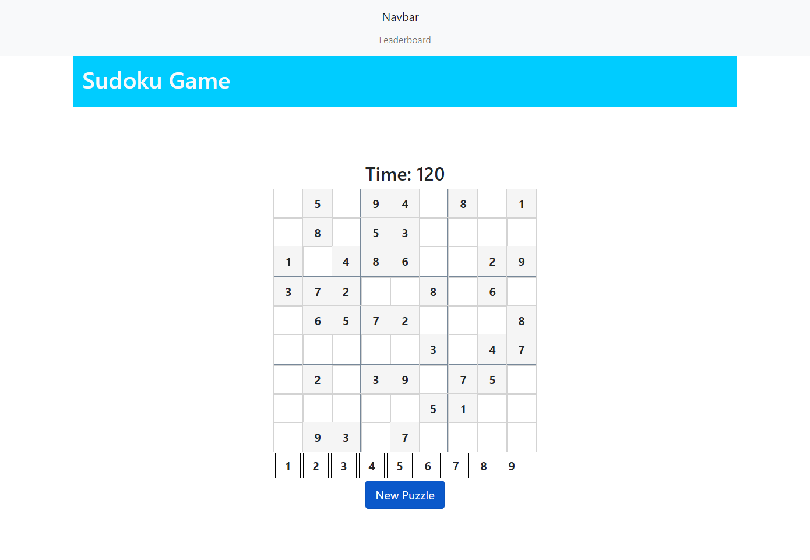

# Sodoku Project 1

## Project description:

This application is a sudoku game with a leaderboard page, timer, scoring system and completion celebration. The user can select from various games and enter their name to appear on the leaderboard.

## Team members:

    Sean Chen
    Chris Gruenhagen
    Patrick Kevlahan
    Jacqueline Stiehl

## Screenshot:

## URL of deployed application:

https://ad31aid.github.io/fantastic-octo-sudoku/

## Acknowledgements:

Tips from University of Minnesota Full Stack Bootcamp instructor Gary Almes and notes from class sessions.

Tips from class TAs: Katy Vincent and Austin Slater.

Used these resources: Stack Overflow and W3Schools
